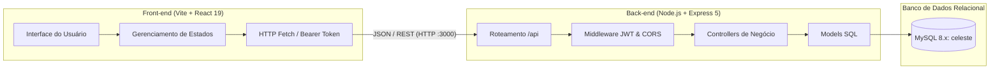
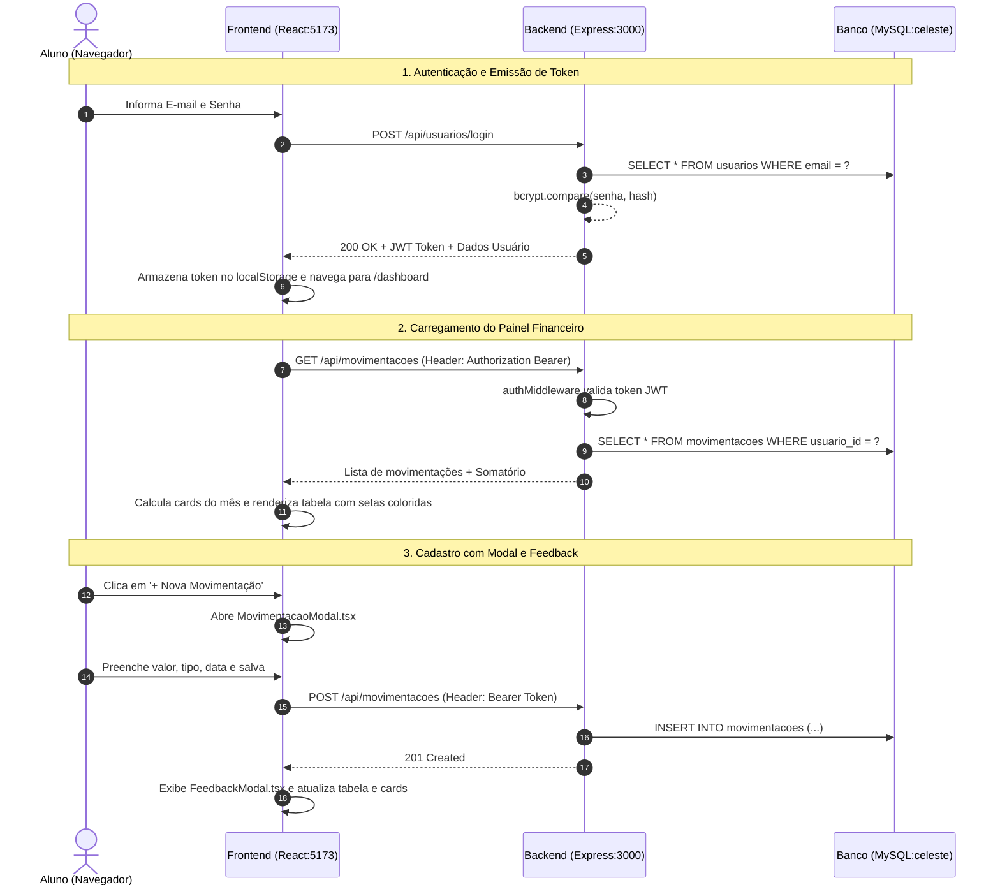

# 💼 MS² Cash Flow — Sistema de Gestão Financeira Pessoal

> **Guia Didático e Documentação Técnica de Instalação e Arquitetura**  
> *Material elaborado para estudantes de Desenvolvimento de Sistemas, com foco em boas práticas de Full Stack, separação de responsabilidades e segurança.*

---

## 📑 Sumário

1. [Visão Geral e Contexto do Projeto](#1-visão-geral-e-contexto-do-projeto)
2. [Stack Tecnológica](#2-stack-tecnológica)
3. [Repositórios Oficiais](#3-repositórios-oficiais)
4. [Preparação do Ambiente de Desenvolvimento](#4-preparação-do-ambiente-de-desenvolvimento)
5. [Passo a Passo: Backend (API)](#5-passo-a-passo-backend-api)
   - [Configuração do Banco de Dados MySQL](#configuração-do-banco-de-dados-mysql)
   - [Instalação e Arquivo `.env`](#instalação-e-arquivo-env)
   - [Inicialização e Teste da API](#inicialização-e-teste-da-api)
6. [Passo a Passo: Frontend (Interface Web)](#6-passo-a-passo-frontend-interface-web)
   - [Instalação e Variáveis de Conexão](#instalação-e-variáveis-de-conexão)
   - [Execução e Portas de Acesso](#execução-e-portas-de-acesso)
7. [Guia de Exploração Didática e Roteiro de Testes](#7-guia-de-exploração-didática-e-roteiro-de-testes)
8. [Pontos Críticos de Aprendizado Técnico](#8-pontos-críticos-de-aprendizado-técnico)

---

## 1. Visão Geral e Contexto do Projeto

O **MS² Cash Flow** é uma aplicação Full Stack projetada para resolver um desafio cotidiano fundamental: o **controle financeiro pessoal e a previsibilidade de fluxo de caixa**.

Em um cenário econômico dinâmico, indivíduos e pequenas operações precisam de visibilidade imediata sobre suas finanças para evitar inadimplência e planejar investimentos. A aplicação proporciona:
- **Centralização:** Registro padronizado de receitas (entradas) e despesas (saídas).
- **Indicadores Rápidos:** Visão instantânea do total de entradas, total de saídas e saldo líquido do mês corrente.
- **Auditoria e Histórico:** Filtragem ágil por natureza de operação e controle total (criação, edição e exclusão segura) de registros.
- **Privacidade e Isolamento:** Cada usuário possui acesso restrito apenas aos seus próprios dados por meio de autenticação baseada em tokens (JWT).



---

## 2. Stack Tecnológica

| Camada | Tecnologia | Versão | Função Principal |
| :--- | :--- | :--- | :--- |
| **Backend** | **Node.js** | `>= 20.x` | Ambiente de execução JavaScript server-side. |
| **Backend** | **Express** | `^5.x` | Framework HTTP para criação de rotas, middlewares e APIs REST. |
| **Backend** | **TypeScript** | `^5.x / 7.x` | Tipagem estática, reduzindo bugs em tempo de desenvolvimento. |
| **Backend** | **MySQL2 (Promise)** | `^3.x` | Driver de alta performance com Pool de Conexões para consultas SQL. |
| **Backend** | **bcrypt** | `^6.x` | Algoritmo criptográfico com *salt* para hashing seguro de senhas. |
| **Backend** | **jsonwebtoken (JWT)** | `^9.x` | Mecanismo stateless de autenticação e proteção de rotas privadas. |
| **Backend** | **CORS** | `^2.x` | Middleware de controle de acesso entre origens distintas. |
| **Backend** | **tsx** | `^4.x` | Execução ágil de TypeScript com recarregamento em tempo real (*watch*). |
| **Frontend** | **React** | `^19.x` | Biblioteca componentizada para interfaces de usuário declarativas. |
| **Frontend** | **Vite** | `^8.x` | Build tool e servidor de desenvolvimento ultra-rápido com HMR. |
| **Frontend** | **Tailwind CSS** | `^4.x` | Framework de estilização utilitária moderna e responsiva. |
| **Frontend** | **React Router DOM** | `^7.x` | Roteamento dinâmico no lado do cliente (SPA - Single Page Application). |
| **Database** | **MySQL** | `^8.x` | Banco de dados relacional (banco `celeste`). |

---

## 3. Repositório Oficial

Para acessar, clonar ou contribuir com o projeto monorepositório contendo o back-end e o front-end integrados:

- 🔗 **Repositório Unificado:** `https://github.com/marcelologan/ms2cashflow-ct.git`

> 💡 *Estrutura Monorepo:* As duas aplicações residem no mesmo repositório:
> - `api-cashflow/` (API Node.js + Express + TypeScript + MySQL)
> - `front-cashflow/` (Interface React 19 + TypeScript + Vite + Tailwind CSS)

---

## 4. Preparação do Ambiente de Desenvolvimento

Antes de inicializar o projeto, certifique-se de que sua máquina atende aos seguintes pré-requisitos:

### Softwares Obrigatórios
1. **Node.js**: Versão **20 LTS** ou superior.
   - Verifique com: `node -v`
2. **NPM**: Versão **10.x** ou superior (instalado junto com o Node.js).
   - Verifique com: `npm -v`
3. **Git**: Para clonagem e versionamento de código.
   - Verifique com: `git -v`
4. **MySQL Server**: Versão **8.0** ou superior (rodando localmente ou via container Docker).

### Comandos de Clonagem (Git)

Abra o seu terminal (Bash, PowerShell ou Prompt de Comando) e execute:

```bash
# Clonando o monorepositório completo
git clone https://github.com/marcelologan/ms2cashflow-ct.git
cd ms2cashflow-ct
```

---

## 5. Passo a Passo: Backend (API)

### Configuração do Banco de Dados MySQL

Abra seu cliente MySQL preferido (MySQL Workbench, DBeaver ou terminal) e execute o script SQL abaixo para estruturar o banco `celeste` e suas respectivas tabelas:

```sql
-- 1. Criação do Banco de Dados
CREATE DATABASE IF NOT EXISTS celeste
  CHARACTER SET utf8mb4 
  COLLATE utf8mb4_unicode_ci;

USE celeste;

-- 2. Tabela de Usuários
CREATE TABLE IF NOT EXISTS usuarios (
  id INT AUTO_INCREMENT PRIMARY KEY,
  email VARCHAR(150) NOT NULL UNIQUE,
  nome VARCHAR(100) NULL,
  telefone VARCHAR(20) NULL,
  senha VARCHAR(255) NOT NULL,
  criado_em TIMESTAMP DEFAULT CURRENT_TIMESTAMP,
  atualizado_em TIMESTAMP DEFAULT CURRENT_TIMESTAMP ON UPDATE CURRENT_TIMESTAMP
);

-- 3. Tabela de Movimentações Financeiras
CREATE TABLE IF NOT EXISTS movimentacoes (
  id INT AUTO_INCREMENT PRIMARY KEY,
  usuario_id INT NOT NULL,
  valor DECIMAL(10,2) NOT NULL,
  tipo ENUM('entrada', 'saida') NOT NULL,
  categoria VARCHAR(50) NOT NULL,
  descricao VARCHAR(255) NULL,
  data_movimentacao DATE NOT NULL,
  criado_em TIMESTAMP DEFAULT CURRENT_TIMESTAMP,
  atualizado_em TIMESTAMP DEFAULT CURRENT_TIMESTAMP ON UPDATE CURRENT_TIMESTAMP,
  CONSTRAINT fk_usuario_movimentacao 
    FOREIGN KEY (usuario_id) REFERENCES usuarios(id) 
    ON DELETE CASCADE
);
```

### Instalação e Arquivo `.env`

1. Pelo terminal, navegue até a pasta da API:
   ```bash
   cd api-cashflow
   ```

2. Instale todas as dependências declaradas no `package.json`:
   ```bash
   npm install
   ```

3. Crie um arquivo chamado `.env` na raiz da pasta `api-cashflow` com os seguintes parâmetros:
   ```env
   # Porta do Servidor Express
   PORT=3000

   # Conexão com o MySQL
   DB_HOST=localhost
   DB_USER=root
   DB_PASSWORD=sua_senha_mysql_aqui
   DB_PORT=3306
   DB_NAME=celeste

   # Chave Secreta para assinatura dos Tokens JWT
   JWT_SECRET=super_secret_jwt_key_turma_desenvolvimento_2026
   ```

> ⚠️ **Atenção:** Em máquinas de laboratório ou ambientes com MariaDB/MySQL em instâncias paralelas, a porta padrão pode variar (ex: `3306` ou `3307`). Ajuste a variável `DB_PORT` conforme sua instalação.

### Inicialização e Teste da API

Inicie o servidor em modo de desenvolvimento com o comando:

```bash
npm run dev
```

Você deverá ver no console saídas semelhantes a:
```text
🔌 Canal de comunicação com o MySQL preparado (Pool de Conexões).
[Server] API rodando na porta 3000
[Rotas] Mapeadas em http://localhost:3000/api/
```

#### Testando a API via Terminal (PowerShell / cURL):
Para validar se a API está online e pronta para responder:

```powershell
# Teste de rota pública de registro de usuário (PowerShell)
Invoke-RestMethod -Uri "http://localhost:3000/api/usuarios" -Method POST -ContentType "application/json" -Body '{"nome":"Aluno Teste","email":"aluno@teste.com","senha":"senhaSegura123"}'
```

---

## 6. Passo a Passo: Frontend (Interface Web)

### Instalação e Variáveis de Conexão

1. Abra uma **nova aba ou janela de terminal** (mantenha o backend rodando na anterior) e navegue até a pasta do frontend:
   ```bash
   cd front-cashflow
   ```

2. Instale os pacotes necessários:
   ```bash
   npm install
   ```

3. **Apontamento de URL da API:**  
   O frontend está configurado para consumir o backend em `http://localhost:3000/api`. Caso o seu backend esteja em outra porta ou IP, verifique os arquivos:
   - [LoginForm.tsx](file:///c:/Users/SENNITT67/OneDrive%20-%20Firjan/Documentos/Projeto%20Cash%20Flow/ms2cashflow/front-cashflow/src/components/Loginform.tsx): Rota `/api/usuarios/login`
   - [Dashboard.tsx](file:///c:/Users/SENNITT67/OneDrive%20-%20Firjan/Documentos/Projeto%20Cash%20Flow/ms2cashflow/front-cashflow/src/components/pages/Dashboard.tsx): Rotas `/api/movimentacoes`
   - [MovimentacaoModal.tsx](file:///c:/Users/SENNITT67/OneDrive%20-%20Firjan/Documentos/Projeto%20Cash%20Flow/ms2cashflow/front-cashflow/src/components/MovimentacaoModal.tsx): Rotas de inclusão e edição

### Execução e Portas de Acesso

Execute o comando de inicialização do Vite:

```bash
npm run dev
```

O terminal exibirá a URL local:
```text
  VITE v8.x.x  ready in 250 ms

  ➜  Local:   http://localhost:5173/
  ➜  Network: use --host to expose
```

Abra seu navegador em **`http://localhost:5173`**.

---

## 7. Guia de Exploração Didática e Roteiro de Testes

Para fixar os conceitos e validar a integração completa entre as pontas, execute o seguinte roteiro didático:



### Roteiro Prático:
1. **Passo 1 — Autenticação:**
   - Faça login na tela inicial com usuário e senha válidos.
   - Abra o Console do Navegador (`F12` -> aba *Application* -> *Local Storage*).
   - Observe a chave `kamikase_token` armazenada.
2. **Passo 2 — Registro de Entrada (Receita):**
   - No Dashboard, clique em **"+ Nova Movimentação"**.
   - Selecione o tipo **Entrada (Crédito)**.
   - Informe Valor: `5000.00`, Categoria: `Salário`, Descrição: `Adiantamento Mensal`, Data: hoje.
   - Clique em **"Cadastrar Movimentação"**.
   - Observe a exibição do **Modal de Feedback** e verifique se o card **"Entradas do Mês"** foi recalculado com a seta verde (`↑`).
3. **Passo 3 — Registro de Saída (Despesa):**
   - Clique novamente em **"+ Nova Movimentação"**.
   - Selecione o tipo **Saída (Débito)**.
   - Informe Valor: `1200.00`, Categoria: `Moradia`, Descrição: `Aluguel`, Data: hoje.
   - Clique em salvar. Verifique se o card **"Saídas do Mês"** subiu e se o **"Saldo do Mês"** agora reflete a diferença positiva (`R$ 3.800,00`).
4. **Passo 4 — Teste de Filtro Reativo:**
   - No `<select>` de filtro, escolha **"Apenas Entradas"** e confirme que apenas o item de Salário é renderizado.
   - Alterne para **"Apenas Saídas"** e depois volte para **"Todas as Movimentações"**.
5. **Passo 5 — Edição de Registro:**
   - Clique no ícone de lápis (Editar) da linha do Aluguel.
   - Mude o valor para `1300.00` e confirme.
6. **Passo 6 — Exclusão com Modal de Confirmação:**
   - Clique no ícone de lixeira (Apagar).
   - Veja o **Modal de Confirmação** com o aviso de segurança.
   - Clique em **"Cancelar"** (verifique que o registro permanece).
   - Clique novamente em apagar e depois em **"Confirmar Exclusão"**. O item desaparecerá e o saldo será recalculado.

---

## 8. Pontos Críticos de Aprendizado Técnico

Como futuro(a) desenvolvedor(a), preste atenção especial aos seguintes conceitos arquiteturais presentes neste código:

### 1. Segurança e Hashing de Senhas (bcrypt)
Nunca armazene senhas em texto puro no banco de dados! Em [usuarioController.ts](file:///c:/Users/SENNITT67/OneDrive%20-%20Firjan/Documentos/Projeto%20Cash%20Flow/ms2cashflow/api-cashflow/src/controllers/usuarioController.ts):
```typescript
const salt = await bcrypt.genSalt(10);
const senhaHash = await bcrypt.hash(senha, salt);
```
O *salt* garante que duas senhas idênticas gerem hashes completamente diferentes, neutralizando ataques de *rainbow table*.

### 2. Autenticação Stateless com JWT e Middlewares
Em [authMiddleware.ts](file:///c:/Users/SENNITT67/OneDrive%20-%20Firjan/Documentos/Projeto%20Cash%20Flow/ms2cashflow/api-cashflow/src/middlewares/authMiddleware.ts), a aplicação intercepta todas as requisições protegidas, extrai o cabeçalho `Authorization: Bearer <token>`, valida a assinatura criptográfica e injeta o `req.usuarioId`. O servidor não precisa de sessão em memória, permitindo escalabilidade horizontal.

### 3. A Mecânica do CORS (Cross-Origin Resource Sharing)
Como o frontend roda em `http://localhost:5173` e a API em `http://localhost:3000`, o navegador trata a comunicação como origens cruzadas. Requisições POST com `Content-Type: application/json` disparam uma requisição prévia do tipo **OPTIONS (Preflight)**. O middleware `cors()` no [server.ts](file:///c:/Users/SENNITT67/OneDrive%20-%20Firjan/Documentos/Projeto%20Cash%20Flow/ms2cashflow/api-cashflow/src/server.ts) responde a esse preflight com os cabeçalhos de liberação necessários.

### 4. Proteção contra IDOR (Insecure Direct Object Reference)
Em [movimentacaoModel.ts](file:///c:/Users/SENNITT67/OneDrive%20-%20Firjan/Documentos/Projeto%20Cash%20Flow/ms2cashflow/api-cashflow/src/models/movimentacaoModel.ts), comandos de consulta, atualização ou exclusão **sempre associam o `id` da movimentação ao `usuario_id` logado**:
```sql
DELETE FROM movimentacoes WHERE id = ? AND usuario_id = ?
```
Isso impede que um usuário mal-intencionado altere ou apague dados de terceiros mudando apenas o ID na URL.

### 5. Tipagem e Type-Only Imports no TypeScript com Vite
No frontend moderno com empacotadores como Vite/esbuild, interfaces e types são eliminados em tempo de compilação. Importar um tipo com `import type { Movimentacao } from './types'` sinaliza ao compilador que nada precisa ser buscado no JavaScript compilado em tempo de execução, prevenindo erros de módulo no navegador.

---

## 👨‍💻 Desenvolvido com foco no aprendizado prático
Dúvidas ou sugestões de melhorias? Abra uma issue ou envie um pull request!

