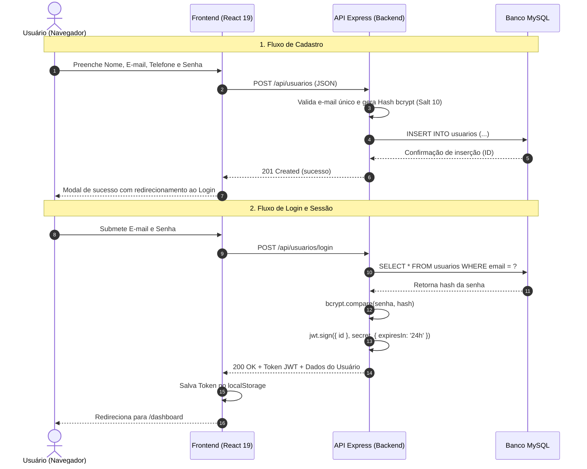

# 🚀 Template Full Stack — Node.js, Express, MySQL & React 19


> **Starter Kit & Template Monorepo Educacional e Profissional**  
> Uma estrutura base sólida, moderna e segura para iniciar qualquer projeto Full Stack com autenticação completa, controle de sessão via JWT, hashing de senhas com bcrypt e persistência em banco relacional MySQL com isolamento total de dados.

---

## 📑 Sumário

1. [Visão Geral](#1-visão-geral)
2. [Estrutura do Monorepositório](#2-estrutura-do-monorepositório)
3. [Stack Tecnológica](#3-stack-tecnológica)
4. [Pré-requisitos](#4-pré-requisitos)
5. [Passo a Passo: Banco de Dados](#5-passo-a-passo-banco-de-dados)
6. [Passo a Passo: Backend (API Express)](#6-passo-a-passo-backend-api-express)
   - [Instalação e Configuração (`.env`)](#instalação-e-configuração-env)
   - [Execução da API](#execução-da-api)
   - [Tabela de Endpoints](#tabela-de-endpoints)
7. [Passo a Passo: Frontend (React 19 + Vite)](#7-passo-a-passo-frontend-react-19--vite)
   - [Instalação](#instalação)
   - [Execução da Interface Web](#execução-da-interface-web)
   - [Mapeamento de Rotas da SPA](#mapeamento-de-rotas-da-spa)
8. [Fluxo de Autenticação e Roteiro de Testes](#8-fluxo-de-autenticação-e-roteiro-de-testes)
9. [Guia de Extensão: Como Adicionar Novas Entidades](#9-guia-de-extensão-como-adicionar-novas-entidades)
10. [Conceitos Críticos de Segurança e Arquitetura](#10-conceitos-críticos-de-segurança-e-arquitetura)

---

## 1. Visão Geral

Este template foi projetado para eliminar o retrabalho na inicialização de novos projetos web. Ele entrega a camada essencial de qualquer sistema pronta e funcionando:

- **Página Inicial (`/`):** Formulário de cadastro de usuário completo e responsivo com validação de dados no cliente e no servidor.
- **Página de Login (`/login`):** Tela de autenticação com armazenamento seguro de token JWT no navegador.
- **Painel Autenticado (`/dashboard`):** Painel protegido com boas-vindas personalizadas, dados da própria conta e espaço modular reservado para acomodar novas regras de negócio.
- **Arquitetura Desacoplada (Monorepo):** Backend e Frontend residem no mesmo repositório, facilitando versionamento conjunto enquanto mantêm total independência de execução.

```mermaid
flowchart LR
    subgraph Frontend["Front-end (Vite + React 19)"]
        UI["Páginas: Cadastro (/), Login (/login), Dashboard (/dashboard)"]
        State["Estados React (useState, useEffect)"]
        Fetch["Fetch HTTP com Bearer Token"]
    end

    subgraph Backend["Back-end (Node.js + Express 5)"]
        Router["Rotas Express (/api/usuarios)"]
        Auth["Middleware JWT & CORS"]
        Controllers["UsuarioController"]
        Models["UsuarioModel"]
    end

    subgraph Database["Banco de Dados Relacional"]
        MySQL[("MySQL 8.x (Banco celeste)")]
    end

    UI --> State --> Fetch
    Fetch -- "JSON / REST (Porta 3000)" --> Router
    Router --> Auth --> Controllers --> Models
    Models --> MySQL
```



---

## 2. Estrutura do Monorepositório

```text
├── backend/                      # Backend RESTful (Node.js + Express + TypeScript)
│   ├── src/
│   │   ├── config/
│   │   │   └── database.ts       # Pool de conexões MySQL2
│   │   ├── controllers/
│   │   │   └── usuarioController.ts # Regras de negócio de usuários e autenticação
│   │   ├── middlewares/
│   │   │   └── authMiddleware.ts # Verificação e validação do token JWT
│   │   ├── models/
│   │   │   └── usuarioModel.ts   # Consultas SQL seguras e tipadas
│   │   ├── routes/
│   │   │   ├── index.ts          # Centralizador de rotas (/api)
│   │   │   └── usuarioRoutes.ts  # Endpoints de cadastro, login e logout
│   │   ├── types/
│   │   │   └── index.ts          # Interfaces e tipos do TypeScript
│   │   └── server.ts             # Inicialização do servidor Express com CORS e JSON
│   ├── .env.example              # Modelo de variáveis de ambiente
│   ├── package.json
│   └── tsconfig.json
│
├── frontend/                     # Frontend SPA (React 19 + TypeScript + Vite + Tailwind 4)
│   ├── src/
│   │   ├── components/
│   │   │   ├── pages/
│   │   │   │   ├── Cadastro.tsx  # Página Inicial com formulário de cadastro
│   │   │   │   ├── Login.tsx     # Página de autenticação
│   │   │   │   └── Dashboard.tsx # Área restrita modular e boas-vindas
│   │   │   ├── CadastroForm.tsx  # Componente isolado de cadastro com validações
│   │   │   ├── Loginform.tsx     # Componente isolado de login
│   │   │   ├── Header.tsx        # Barra de navegação responsiva com estado dinâmico
│   │   │   ├── Footer.tsx        # Rodapé institucional
│   │   │   ├── FeedbackModal.tsx # Modal animado para feedbacks de sucesso e erro
│   │   │   └── ConfirmacaoModal.tsx # Modal genérico para confirmação de ações
│   │   ├── App.tsx               # Roteamento SPA com React Router DOM v7
│   │   ├── main.tsx              # Ponto de entrada React com StrictMode
│   │   ├── types.ts              # Tipagens da entidade Usuario
│   │   └── index.css             # Importação do Tailwind CSS v4
│   ├── package.json
│   ├── vite.config.ts
│   └── index.html
│
└── README.md                     # Documentação mestre do projeto
```

---

## 3. Stack Tecnológica

| Camada | Tecnologia | Versão | Papel na Aplicação |
| :--- | :--- | :---: | :--- |
| **Backend Runtime** | Node.js | `20+ LTS` | Ambiente de execução JavaScript assíncrono. |
| **Backend Framework** | Express | `5.x` | Criação de rotas, middlewares e APIs RESTful. |
| **Linguagem Principal** | TypeScript | `5.x` | Tipagem estática, interfaces e detecção de erros em tempo de compilação. |
| **Banco de Dados** | MySQL | `8.x` | Banco relacional com integridade referencial e índices únicos. |
| **Driver de Conexão** | `mysql2/promise` | `3.x` | Conexões via Pool com suporte nativo a Promises (`async/await`). |
| **Criptografia** | `bcrypt` | `6.x` | Algoritmo de hash adaptativo com salt (custo 10) para proteção de senhas. |
| **Segurança & Sessão** | `jsonwebtoken` | `9.x` | Emissão e validação de tokens JWT stateless. |
| **Frontend Framework** | React | `19.x` | Interface declarativa baseada em componentes funcionais. |
| **Bundler & Build Tool** | Vite | `8.x` | Servidor de desenvolvimento ultrarrápido com Hot Module Replacement (HMR). |
| **Estilização** | Tailwind CSS | `4.x` | Estilização utilitária moderna com suporte nativo a transições e temas. |
| **Roteamento Web** | React Router DOM | `7.x` | Navegação cliente sem recarregar a página (SPA). |

---

## 4. Pré-requisitos

Antes de iniciar, certifique-se de possuir em seu sistema:

- **Node.js**: Versão 20 LTS ou superior instalada (`node -v`).
- **NPM**: Gerenciador de pacotes (`npm -v`).
- **Servidor MySQL**: Instância local ou remota ativa (porta padrão `3306` ou `3307`).
- **Git**: Para controle de versão.

---

## 5. Passo a Passo: Banco de Dados

Crie o banco de dados e a tabela de usuários executando o script SQL a seguir no seu cliente MySQL preferido (DBeaver, MySQL Workbench ou terminal):

```sql
-- 1. Criação do Banco de Dados
CREATE DATABASE IF NOT EXISTS celeste
  CHARACTER SET utf8mb4
  COLLATE utf8mb4_unicode_ci;

USE celeste;

-- 2. Criação da Tabela de Usuários
CREATE TABLE IF NOT EXISTS usuarios (
  id INT AUTO_INCREMENT PRIMARY KEY,
  email VARCHAR(191) NOT NULL UNIQUE,
  nome VARCHAR(100) NULL,
  telefone VARCHAR(20) NULL,
  senha VARCHAR(255) NOT NULL,
  criado_em TIMESTAMP DEFAULT CURRENT_TIMESTAMP,
  atualizado_em TIMESTAMP DEFAULT CURRENT_TIMESTAMP ON UPDATE CURRENT_TIMESTAMP
) ENGINE=InnoDB;
```

---

## 6. Passo a Passo: Backend (API Express)

### Instalação e Configuração (`.env`)

1. No terminal, acesse o diretório da API:
   ```bash
   cd backend
   ```

2. Instale as dependências:
   ```bash
   npm install
   ```

3. Configure o arquivo `.env` na raiz da pasta `backend` (você pode se basear no `backend/.env.example`):
   ```env
   # Porta da API
   PORT=3000

   # Credenciais do MySQL
   DB_HOST=localhost
   DB_USER=root
   DB_PASSWORD=sua_senha_aqui
   DB_PORT=3306
   DB_NAME=celeste

   # Chave Secreta para assinatura dos Tokens JWT
   JWT_SECRET=super_secret_jwt_key_template_2026
   ```

### Execução da API

Inicie o servidor de desenvolvimento:

```bash
npm run dev
```

Saída esperada no terminal:
```text
🔌 Canal de comunicação com o MySQL preparado (Pool de Conexões).
[Server] API rodando na porta 3000
[Rotas] Mapeadas em http://localhost:3000/api/
```

### Tabela de Endpoints

Todas as rotas possuem o prefixo base `/api/usuarios` com foco no **isolamento de dados**:

| Método | Endpoint | Protegida? | Descrição | Payload / Parâmetros |
| :---: | :--- | :---: | :--- | :--- |
| `POST` | `/api/usuarios` | ❌ Não | Cadastra um novo usuário no banco. | `{ "nome", "email", "telefone", "senha" }` |
| `POST` | `/api/usuarios/login` | ❌ Não | Autentica o usuário e devolve o token JWT. | `{ "email", "senha" }` |
| `POST` | `/api/usuarios/logout` | 🔒 Sim (JWT) | Registra a saída e instrui o cliente a descartar o token. | Header `Authorization: Bearer <token>` |

---

## 7. Passo a Passo: Frontend (React 19 + Vite)

### Instalação

1. Abra uma **nova aba ou janela de terminal** e acesse a pasta do frontend:
   ```bash
   cd frontend
   ```

2. Instale as dependências:
   ```bash
   npm install
   ```

### Execução da Interface Web

Execute o servidor Vite:

```bash
npm run dev
```

Acesse o sistema no navegador através do endereço exibido: **`http://localhost:5173`**.

### Mapeamento de Rotas da SPA

- **`http://localhost:5173/` (Página Inicial):** Formulário de cadastro de usuários com validação instantânea, máscara de telefone e feedback visual.
- **`http://localhost:5173/login`:** Tela de login com redirecionamento automático para o dashboard.
- **`http://localhost:5173/dashboard`:** Painel autenticado com boas-vindas ao usuário, exibição dos dados da própria conta e espaço modular reservado para futuros módulos.

---

## 8. Fluxo de Autenticação e Roteiro de Testes



---

## 9. Guia de Extensão: Como Adicionar Novas Entidades

Para adicionar novas funcionalidades (exemplo: Módulo de Produtos ou Finanças):

1. **Crie a Tabela no Banco com Chave Estrangeira:**
   ```sql
   CREATE TABLE produtos (
     id INT AUTO_INCREMENT PRIMARY KEY,
     usuario_id INT NOT NULL,
     nome VARCHAR(100) NOT NULL,
     preco DECIMAL(10,2) NOT NULL,
     criado_em TIMESTAMP DEFAULT CURRENT_TIMESTAMP,
     CONSTRAINT fk_usuario_produto FOREIGN KEY (usuario_id) REFERENCES usuarios(id) ON DELETE CASCADE
   );
   ```

2. **Crie o Model no Backend (`backend/src/models/produtoModel.ts`):**
   - Utilize consultas parametrizadas com `db.execute()`.

3. **Crie o Controller no Backend (`backend/src/controllers/produtoController.ts`):**
   - Acesse o ID do usuário conectado via `req.usuarioId` (injetado pelo `authMiddleware`).

4. **Defina as Rotas (`backend/src/routes/produtoRoutes.ts`):**
   - Proteja as rotas que exigem autenticação com o middleware:
   ```typescript
   router.post('/', authMiddleware, ProdutoController.criar as any);
   ```
   - Registre o novo prefixo em `backend/src/routes/index.ts`:
   ```typescript
   router.use('/produtos', produtoRoutes);
   ```

5. **Crie os Componentes no Frontend:**
   - Adicione telas e formulários em `frontend/src/components/pages/` e vincule em `frontend/src/App.tsx`.

---

## 10. Conceitos Críticos de Segurança e Arquitetura

- **Hashing com Salt (bcrypt):** Senhas nunca são guardadas em texto claro. O salt garante hashes distintos mesmo para senhas idênticas, evitando ataques por tabela arco-íris.
- **Autenticação Stateless (JWT):** O servidor valida a integridade do token através da assinatura criptográfica sem necessidade de manter sessões em memória ou banco, facilitando escalabilidade.
- **Fail-Fast & Sanitização:** Validações de entrada eliminam espaços desnecessários, normalizam e-mails para minúsculas e recusam requisições inválidas antes mesmo de consultar o banco.
- **Proteção contra IDOR & Isolamento:** Ao associar operações sensíveis ao `usuarioId` contido no token JWT validado pelo servidor, impede-se que um usuário manipule dados de outros.

---

## 📄 Licença

Distribuído sob a licença **MIT**. Consulte `LICENSE` para mais informações.
